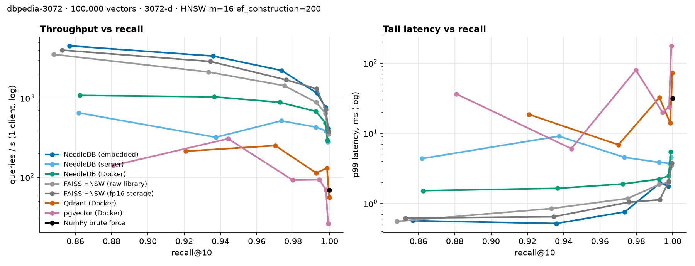
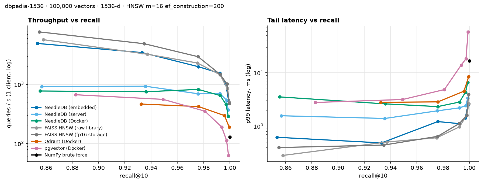

# NeedleDB benchmarks

Generated 2026-09-15 by `python -m bench.report` from `bench/results/*.json`.
Reproduce with the commands under [Method](#method).

## dbpedia-3072 — 100,000 × 3072-d



### At ≥ 95% recall@10

The smallest `ef_search` in the sweep that reaches 95% recall (or the best reached).

| System | Transport | Build | Memory | ef | Recall@10 | p50 | p99 | QPS, 1 client | QPS, 16 clients |
|---|---|---:|---:|---:|---:|---:|---:|---:|---:|
| **NeedleDB (embedded)** | in-process | 52.7 s | 2.36 GiB | 64 | 0.974 | 0.42 ms | 0.76 ms | 2,224 | 9,751 |
| **NeedleDB (server)** | http+json | 66.8 s | 1.32 GiB | 64 | 0.974 | 1.69 ms | 4.54 ms | 515 | 3,349 |
| **NeedleDB (Docker)** | http+json | 105.4 s | 0.83 GiB | 64 | 0.973 | 1.08 ms | 1.90 ms | 881 | 2,818 |
| **FAISS HNSW (raw library)** | in-process | 46.8 s | 1.56 GiB | 64 | 0.975 | 0.68 ms | 1.18 ms | 1,427 | 5,832 |
| **FAISS HNSW (fp16 storage)** | in-process | 52.4 s | 2.46 GiB | 64 | 0.976 | 0.55 ms | 1.04 ms | 1,695 | 9,601 |
| **Qdrant (Docker)** | grpc | 243.5 s | 0.90 GiB | 32 | 0.970 | 3.71 ms | 6.85 ms | 251 | 1,230 |
| **pgvector (Docker)** | postgres | 481.1 s | 1.72 GiB | 64 | 0.980 | 5.96 ms | 79.5 ms | 92 | 900 |
| **NumPy brute force** | in-process | 0.0 s | 1.15 GiB | — | 1.000 | 13.4 ms | 31.5 ms | 69 | 166 |

### Filtered queries

Recall@10 against exact filtered ground truth, and p50 latency, at the same `ef_search`. The filter keeps the stated share of the corpus, uncorrelated with the vectors.

| System | 50% | 10% | 1% | 0.1% |
|---|---:|---:|---:|---:|
| **NeedleDB (embedded)** | 0.981 · 0.75 ms | 0.978 · 1.40 ms | 1.000 · 0.82 ms | 1.000 · 0.09 ms |
| **NeedleDB (server)** | 0.982 · 1.68 ms | 0.982 · 2.15 ms | 1.000 · 1.76 ms | 1.000 · 0.72 ms |
| **NeedleDB (Docker)** | 0.981 · 1.33 ms | 0.981 · 1.88 ms | 1.000 · 3.16 ms | 1.000 · 0.77 ms |
| **FAISS HNSW (raw library)** | 0.967 · 0.85 ms | 0.875 · 0.72 ms | 0.458 · 0.76 ms | 0.113 · 0.63 ms |
| **FAISS HNSW (fp16 storage)** | 0.965 · 0.65 ms | 0.872 · 0.61 ms | 0.455 · 0.57 ms | 0.114 · 0.52 ms |
| **Qdrant (Docker)** | 0.949 · 5.58 ms | 0.991 · 5.11 ms | 1.000 · 3.70 ms | 1.000 · 2.92 ms |
| **pgvector (Docker)** | 0.972 · 8.29 ms | 0.963 · 26.0 ms | 1.000 · 21.2 ms | 1.000 · 2.82 ms |
| **NumPy brute force** | 1.000 · 13.5 ms | 1.000 · 13.7 ms | 1.000 · 12.7 ms | 1.000 · 13.0 ms |

<details><summary>Full ef_search sweep</summary>

| System | ef | Recall@10 | p50 | p95 | p99 | QPS |
|---|---:|---:|---:|---:|---:|---:|
| NeedleDB (embedded) | 16 | 0.8569 | 0.19 ms | 0.39 ms | 0.57 ms | 4,546 |
| NeedleDB (embedded) | 32 | 0.9359 | 0.28 ms | 0.44 ms | 0.52 ms | 3,385 |
| NeedleDB (embedded) | 64 | 0.9737 | 0.42 ms | 0.65 ms | 0.76 ms | 2,224 |
| NeedleDB (embedded) | 128 | 0.9931 | 0.79 ms | 1.28 ms | 1.95 ms | 1,153 |
| NeedleDB (embedded) | 256 | 0.9978 | 1.31 ms | 1.57 ms | 1.77 ms | 769 |
| NeedleDB (embedded) | 512 | 0.9992 | 2.40 ms | 2.94 ms | 3.72 ms | 413 |
| NeedleDB (server) | 16 | 0.8619 | 1.36 ms | 2.37 ms | 4.36 ms | 649 |
| NeedleDB (server) | 32 | 0.9374 | 1.51 ms | 4.55 ms | 9.09 ms | 319 |
| NeedleDB (server) | 64 | 0.9735 | 1.69 ms | 3.06 ms | 4.54 ms | 515 |
| NeedleDB (server) | 128 | 0.9925 | 2.18 ms | 2.84 ms | 3.86 ms | 429 |
| NeedleDB (server) | 256 | 0.9983 | 2.55 ms | 3.33 ms | 3.73 ms | 384 |
| NeedleDB (server) | 512 | 0.9991 | 3.59 ms | 4.16 ms | 4.58 ms | 279 |
| NeedleDB (Docker) | 16 | 0.8625 | 0.89 ms | 1.19 ms | 1.52 ms | 1,079 |
| NeedleDB (Docker) | 32 | 0.9366 | 0.94 ms | 1.20 ms | 1.64 ms | 1,032 |
| NeedleDB (Docker) | 64 | 0.9727 | 1.08 ms | 1.50 ms | 1.90 ms | 881 |
| NeedleDB (Docker) | 128 | 0.9926 | 1.45 ms | 1.74 ms | 2.22 ms | 677 |
| NeedleDB (Docker) | 256 | 0.9979 | 2.08 ms | 2.33 ms | 2.47 ms | 483 |
| NeedleDB (Docker) | 512 | 0.9990 | 3.33 ms | 4.34 ms | 5.42 ms | 293 |
| FAISS HNSW (raw library) | 16 | 0.8481 | 0.27 ms | 0.41 ms | 0.56 ms | 3,548 |
| FAISS HNSW (raw library) | 32 | 0.9333 | 0.45 ms | 0.64 ms | 0.85 ms | 2,128 |
| FAISS HNSW (raw library) | 64 | 0.9753 | 0.68 ms | 0.94 ms | 1.18 ms | 1,427 |
| FAISS HNSW (raw library) | 128 | 0.9927 | 1.09 ms | 1.56 ms | 1.87 ms | 881 |
| FAISS HNSW (raw library) | 256 | 0.9978 | 1.57 ms | 1.83 ms | 1.99 ms | 642 |
| FAISS HNSW (raw library) | 512 | 0.9995 | 2.87 ms | 3.36 ms | 3.51 ms | 351 |
| FAISS HNSW (fp16 storage) | 16 | 0.8528 | 0.23 ms | 0.37 ms | 0.62 ms | 4,019 |
| FAISS HNSW (fp16 storage) | 32 | 0.9345 | 0.33 ms | 0.51 ms | 0.65 ms | 2,889 |
| FAISS HNSW (fp16 storage) | 64 | 0.9761 | 0.55 ms | 0.85 ms | 1.04 ms | 1,695 |
| FAISS HNSW (fp16 storage) | 128 | 0.9930 | 0.75 ms | 0.97 ms | 1.13 ms | 1,305 |
| FAISS HNSW (fp16 storage) | 256 | 0.9980 | 1.38 ms | 1.85 ms | 2.07 ms | 714 |
| FAISS HNSW (fp16 storage) | 512 | 0.9996 | 2.62 ms | 3.37 ms | 3.76 ms | 376 |
| Qdrant (Docker) | 16 | 0.9208 | 3.68 ms | 9.43 ms | 18.6 ms | 213 |
| Qdrant (Docker) | 32 | 0.9702 | 3.71 ms | 5.81 ms | 6.85 ms | 251 |
| Qdrant (Docker) | 64 | 0.9928 | 6.85 ms | 14.4 ms | 32.4 ms | 113 |
| Qdrant (Docker) | 128 | 0.9987 | 7.22 ms | 10.2 ms | 14.0 ms | 131 |
| Qdrant (Docker) | 256 | 0.9999 | 14.6 ms | 25.2 ms | 72.2 ms | 56 |
| pgvector (Docker) | 16 | 0.8809 | 4.77 ms | 17.8 ms | 36.3 ms | 141 |
| pgvector (Docker) | 32 | 0.9442 | 3.10 ms | 4.54 ms | 6.04 ms | 306 |
| pgvector (Docker) | 64 | 0.9798 | 5.96 ms | 35.1 ms | 79.5 ms | 92 |
| pgvector (Docker) | 128 | 0.9945 | 10.3 ms | 15.3 ms | 19.8 ms | 93 |
| pgvector (Docker) | 256 | 0.9981 | 14.2 ms | 19.9 ms | 23.7 ms | 69 |
| pgvector (Docker) | 512 | 0.9993 | 30.5 ms | 92.5 ms | 176.0 ms | 26 |
| NumPy brute force | — | 1.0000 | 13.4 ms | 17.8 ms | 31.5 ms | 69 |

</details>

Machine: Apple M5 Pro · 15 cores · 24.00 GiB RAM · Python 3.12.12 · FAISS 1.15.0 · Docker VM 15 CPUs / 7.75 GiB

Versions: faiss 1.15.0, needledb 0.1.0, qdrant 1.19.1, pgvector 0.8.6, postgres 17.11 (Debian 17.11-1.pgdg12+2), vectorType fp16

## dbpedia-1536 — 100,000 × 1536-d



### At ≥ 95% recall@10

The smallest `ef_search` in the sweep that reaches 95% recall (or the best reached).

| System | Transport | Build | Memory | ef | Recall@10 | p50 | p99 | QPS, 1 client | QPS, 16 clients |
|---|---|---:|---:|---:|---:|---:|---:|---:|---:|
| **NeedleDB (embedded)** | in-process | 31.2 s | 1.23 GiB | 64 | 0.976 | 0.47 ms | 1.22 ms | 1,995 | 10,454 |
| **NeedleDB (server)** | http+json | 39.7 s | 0.72 GiB | 64 | 0.976 | 1.19 ms | 1.94 ms | 696 | 3,695 |
| **NeedleDB (Docker)** | http+json | 56.2 s | 0.78 GiB | 64 | 0.976 | 1.14 ms | 2.32 ms | 823 | 2,510 |
| **FAISS HNSW (raw library)** | in-process | 28.1 s | 0.83 GiB | 64 | 0.975 | 0.42 ms | 0.61 ms | 2,304 | 12,322 |
| **FAISS HNSW (fp16 storage)** | in-process | 21.9 s | 1.47 GiB | 64 | 0.976 | 0.32 ms | 0.64 ms | 2,944 | 17,994 |
| **Qdrant (Docker)** | grpc | 120.8 s | 0.91 GiB | 32 | 0.976 | 2.35 ms | 2.85 ms | 423 | 2,012 |
| **pgvector (Docker)** | postgres | 503.7 s | 1.72 GiB | 64 | 0.981 | 2.73 ms | 4.84 ms | 353 | 2,336 |
| **NumPy brute force** | in-process | 0.0 s | 0.57 GiB | — | 1.000 | 6.96 ms | 16.7 ms | 129 | 324 |

### Filtered queries

Recall@10 against exact filtered ground truth, and p50 latency, at the same `ef_search`. The filter keeps the stated share of the corpus, uncorrelated with the vectors.

| System | 50% | 10% | 1% | 0.1% |
|---|---:|---:|---:|---:|
| **NeedleDB (embedded)** | 0.979 · 0.59 ms | 0.978 · 0.94 ms | 1.000 · 0.48 ms | 1.000 · 0.09 ms |
| **NeedleDB (server)** | 0.980 · 1.32 ms | 0.979 · 1.76 ms | 1.000 · 1.53 ms | 1.000 · 0.95 ms |
| **NeedleDB (Docker)** | 0.981 · 1.47 ms | 0.978 · 1.88 ms | 1.000 · 4.83 ms | 1.000 · 0.83 ms |
| **FAISS HNSW (raw library)** | 0.968 · 0.46 ms | 0.882 · 0.42 ms | 0.461 · 0.42 ms | 0.104 · 0.49 ms |
| **FAISS HNSW (fp16 storage)** | 0.967 · 0.35 ms | 0.883 · 0.33 ms | 0.465 · 0.33 ms | 0.107 · 0.33 ms |
| **Qdrant (Docker)** | 0.969 · 2.80 ms | 0.991 · 2.32 ms | 1.000 · 1.68 ms | 1.000 · 1.20 ms |
| **pgvector (Docker)** | 0.972 · 3.22 ms | 0.964 · 4.21 ms | 1.000 · 3.66 ms | 1.000 · 0.51 ms |
| **NumPy brute force** | 1.000 · 6.86 ms | 1.000 · 5.72 ms | 1.000 · 5.71 ms | 1.000 · 5.93 ms |

<details><summary>Full ef_search sweep</summary>

| System | ef | Recall@10 | p50 | p95 | p99 | QPS |
|---|---:|---:|---:|---:|---:|---:|
| NeedleDB (embedded) | 16 | 0.8535 | 0.18 ms | 0.34 ms | 0.62 ms | 4,928 |
| NeedleDB (embedded) | 32 | 0.9331 | 0.28 ms | 0.39 ms | 0.48 ms | 3,454 |
| NeedleDB (embedded) | 64 | 0.9760 | 0.47 ms | 0.73 ms | 1.22 ms | 1,995 |
| NeedleDB (embedded) | 128 | 0.9923 | 0.62 ms | 0.90 ms | 1.11 ms | 1,544 |
| NeedleDB (embedded) | 256 | 0.9969 | 0.98 ms | 1.21 ms | 1.43 ms | 1,019 |
| NeedleDB (embedded) | 512 | 0.9990 | 1.85 ms | 2.25 ms | 2.49 ms | 540 |
| NeedleDB (server) | 16 | 0.8568 | 1.07 ms | 1.32 ms | 1.56 ms | 923 |
| NeedleDB (server) | 32 | 0.9357 | 1.02 ms | 1.25 ms | 1.39 ms | 932 |
| NeedleDB (server) | 64 | 0.9757 | 1.19 ms | 1.55 ms | 1.94 ms | 696 |
| NeedleDB (server) | 128 | 0.9924 | 1.39 ms | 1.80 ms | 2.20 ms | 701 |
| NeedleDB (server) | 256 | 0.9973 | 1.80 ms | 2.23 ms | 2.42 ms | 547 |
| NeedleDB (server) | 512 | 0.9988 | 2.67 ms | 3.08 ms | 3.35 ms | 369 |
| NeedleDB (Docker) | 16 | 0.8555 | 1.14 ms | 2.43 ms | 3.53 ms | 774 |
| NeedleDB (Docker) | 32 | 0.9361 | 0.97 ms | 1.93 ms | 2.61 ms | 752 |
| NeedleDB (Docker) | 64 | 0.9760 | 1.14 ms | 1.95 ms | 2.32 ms | 823 |
| NeedleDB (Docker) | 128 | 0.9926 | 1.43 ms | 2.33 ms | 2.83 ms | 650 |
| NeedleDB (Docker) | 256 | 0.9971 | 2.06 ms | 3.11 ms | 4.34 ms | 460 |
| NeedleDB (Docker) | 512 | 0.9988 | 3.31 ms | 4.84 ms | 6.57 ms | 289 |
| FAISS HNSW (raw library) | 16 | 0.8580 | 0.17 ms | 0.24 ms | 0.28 ms | 5,706 |
| FAISS HNSW (raw library) | 32 | 0.9373 | 0.30 ms | 0.44 ms | 0.50 ms | 3,234 |
| FAISS HNSW (raw library) | 64 | 0.9753 | 0.42 ms | 0.57 ms | 0.61 ms | 2,304 |
| FAISS HNSW (raw library) | 128 | 0.9925 | 0.68 ms | 0.87 ms | 0.97 ms | 1,459 |
| FAISS HNSW (raw library) | 256 | 0.9981 | 1.17 ms | 1.44 ms | 1.60 ms | 850 |
| FAISS HNSW (raw library) | 512 | 0.9996 | 2.00 ms | 2.36 ms | 2.62 ms | 501 |
| FAISS HNSW (fp16 storage) | 16 | 0.8549 | 0.11 ms | 0.25 ms | 0.40 ms | 7,727 |
| FAISS HNSW (fp16 storage) | 32 | 0.9348 | 0.19 ms | 0.33 ms | 0.44 ms | 4,877 |
| FAISS HNSW (fp16 storage) | 64 | 0.9758 | 0.32 ms | 0.52 ms | 0.64 ms | 2,944 |
| FAISS HNSW (fp16 storage) | 128 | 0.9925 | 0.65 ms | 0.94 ms | 1.12 ms | 1,483 |
| FAISS HNSW (fp16 storage) | 256 | 0.9979 | 0.97 ms | 1.31 ms | 1.57 ms | 1,015 |
| FAISS HNSW (fp16 storage) | 512 | 0.9995 | 2.02 ms | 2.75 ms | 3.93 ms | 474 |
| Qdrant (Docker) | 16 | 0.9325 | 2.10 ms | 2.55 ms | 2.80 ms | 465 |
| Qdrant (Docker) | 32 | 0.9761 | 2.35 ms | 2.64 ms | 2.85 ms | 423 |
| Qdrant (Docker) | 64 | 0.9959 | 3.32 ms | 3.93 ms | 4.52 ms | 298 |
| Qdrant (Docker) | 128 | 0.9995 | 5.16 ms | 6.10 ms | 8.41 ms | 190 |
| pgvector (Docker) | 16 | 0.8827 | 1.42 ms | 2.09 ms | 2.78 ms | 669 |
| pgvector (Docker) | 32 | 0.9492 | 1.73 ms | 2.43 ms | 3.16 ms | 559 |
| pgvector (Docker) | 64 | 0.9810 | 2.73 ms | 3.97 ms | 4.84 ms | 353 |
| pgvector (Docker) | 128 | 0.9938 | 4.46 ms | 8.40 ms | 13.9 ms | 190 |
| pgvector (Docker) | 256 | 0.9975 | 8.35 ms | 12.8 ms | 18.4 ms | 113 |
| pgvector (Docker) | 512 | 0.9990 | 14.3 ms | 22.1 ms | 58.5 ms | 63 |
| NumPy brute force | — | 1.0000 | 6.96 ms | 11.3 ms | 16.7 ms | 129 |

</details>

Machine: Apple M5 Pro · 15 cores · 24.00 GiB RAM · Python 3.12.12 · FAISS 1.15.0 · Docker VM 15 CPUs / 7.75 GiB

Versions: faiss 1.15.0, needledb 0.1.0, qdrant 1.19.1, pgvector 0.8.6, postgres 17.11 (Debian 17.11-1.pgdg12+2), vectorType fp16

## Method

**Data.** Real OpenAI `text-embedding-3-large` embeddings of DBpedia entities (Qdrant's public
copies on Hugging Face) at 1536 and 3072 dimensions, unit-normalised, cosine similarity. The
first *n* rows are the corpus; the next 1,000 rows are held-out queries, so no query is in the
corpus. Ground truth is exact brute force.

**Index.** Every graph index is HNSW with the same `m` and `ef_construction`. `ef_search` is
swept; the headline row for each system is the smallest value reaching 95% recall@10.

**Latency.** Single client, sequential, measured end to end by the benchmark process — in-process
calls for the embedded engines, a real network round trip (with serialization) for servers.

**Concurrency.** N clients for 10 seconds. Networked systems (NeedleDB server and Docker, Qdrant,
pgvector) get one client *process* per connection, so no result is capped by a single Python
interpreter's lock on the client side. In-process engines can't be shared across processes and
use N threads.

**Build.** Wall time from an empty index to every vector searchable through the index: all writes,
the durable log (NeedleDB and Postgres), and graph construction.

**Memory.** Embedded engines: resident memory the process gained while loading. NeedleDB server:
server process RSS. Docker services: `docker stats` for the container.

**Filters.** Each vector carries four integer fields; `{"s1": 0}` keeps 1% of the corpus, etc.
Qdrant fields are payload-indexed before loading, pgvector uses a b-tree per field and
`hnsw.iterative_scan = relaxed_order`, NeedleDB uses its own planner (exact scan of the
matching subset when small, otherwise filtered HNSW with a widened beam).

**Fairness notes.**
- Docker services run in the same Docker Desktop VM with identical CPU and memory limits and
  are reached over the VM's port forwarding; compare `needledb-docker` with Qdrant and pgvector
  for a like-for-like view. Embedded and native-server rows run on the host with all cores.
- Each system uses its fastest standard wire format: Qdrant gRPC; Postgres its binary protocol
  with prepared statements; NeedleDB HTTP/JSON with vectors as base64 float32 (what its SDK
  sends by default).
- pgvector's `vector` type indexes at most 2,000 dimensions, so the 3072-d run uses `halfvec`
  (float16), which is lossy.
- One machine, one run per configuration. Treat differences under ~10% as noise. The published
  runs shared the machine with unrelated CPU-heavy training jobs (load average 12–20 on 15 cores),
  so absolute numbers are conservative; every system ran under the same conditions.
- Docker Desktop on macOS adds a port-forwarding hop to every request, which dominates the
  Docker rows at this latency scale; the native NeedleDB server row shows the same code without it.

**Reproduce.**

```bash
pip install -e ".[bench]"
python -m bench.run --dataset dbpedia-3072 --n 100000 \
    --systems numpy-exact,faiss-hnsw,needledb-embedded,needledb-server
docker compose -f bench/docker-compose.yml up -d --build
python -m bench.run --dataset dbpedia-3072 --n 100000 \
    --systems needledb-docker,qdrant-docker,pgvector-docker
python -m bench.report
```
